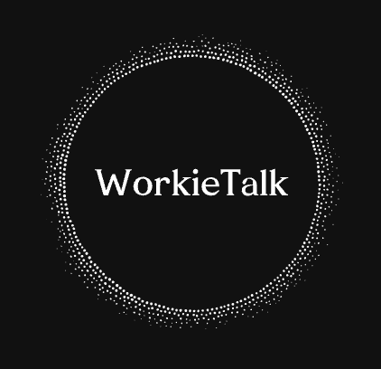
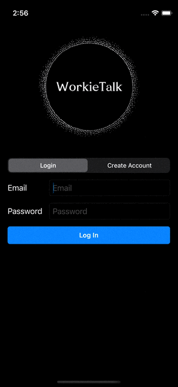
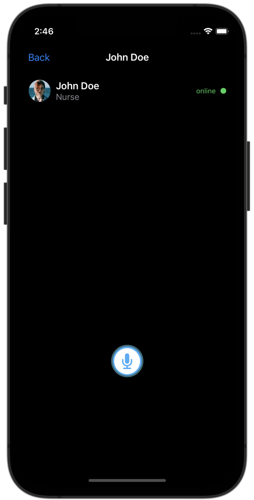
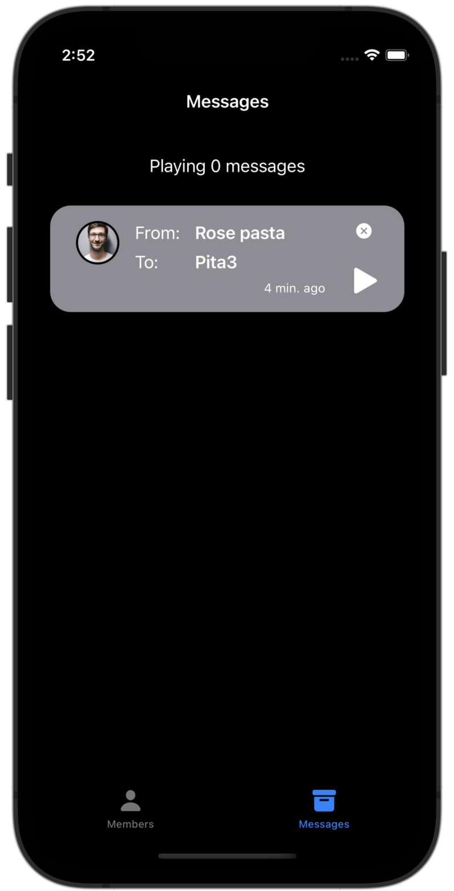

# CommunicationApp

**Communication Made Easy** - Just press and talk to your coworkers.

Hi there! This app is developed by George, Peter(me), Kush, and Nathan as a UNC COMP523 course project with a client, David Berkoff.
This is a ‘walkie talkie’ type app for medical clinic staff that will allow you to create work groups that you can communicate with from any location in the clinic. The voice messages will be transmitted to all members of the group immediately, along with being transcribed and stored for a short period of time on HIPAA safe servers. 

If you want to see the project details, check out our website ([@website](https://tarheels.live/comp523grouph/)).

 
 

  
  
  

## Simple, Intuitive Design

The simplest way to communicate.

- Click the person who you want to talk to.
- Record your message and send.

Create your own chat groups.

- Easily group your coworkers.
- Send your messages to the group at once.

## Reliable and Easy to Use

Never miss any messages.

- Every message will be stored in the message box.
- Simply replay the messages.

Free from too many messages.

- Messages will be stored only for 10 mins.
- Simply remove the messages.

### **Support**

We don’t offer traditional support, but you can email us ([@contacts](https://tarheels.live/comp523grouph/team/team-members/)) with any inquiries. Thanks!
